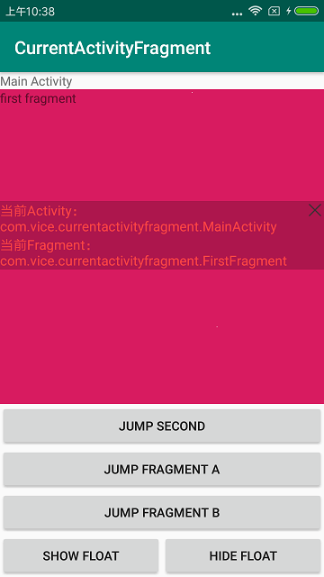

## 介绍

1.接手新项目时由于对项目代码不熟悉，找相应的界面会耗费大量时间，于是开发了这个库。

2.侵入性低，无需在每个页面或者基类调用设置代码。

## 注意

由于使用了FragmentLifecycleCallbacks来监听Fragment生命周期，所以要求v4包版本在25.1.0以上

## 展示



## 使用 

#### 引用

```gradle
dependencies {
	...
    debugImplementation 'com.vicedev:curacfr:1.0.0'
    releaseImplementation 'com.vicedev:curacfr-no-op:1.0.0'
}
```

##### 初始化：

~~~kotlin
class App : Application() {
    override fun onCreate() {
        super.onCreate()
        CurAcFr.init(this)
    }
}
~~~

##### 打开悬浮窗

~~~kotlin
//方式一：使用默认的悬浮窗界面
CurAcFr.show()
//方式二：参数1：当前页面的返回监听，参数2：是否使用默认的悬浮窗
CurAcFr.show(object : CurAcFr.OnChangeListener {
    override fun onCurrentActivityChange(currentActivityName: String?) {  
     }
    override fun onCurrentFragmentChange(currentFragmentName: String?) {
     }
}, false)    
~~~

##### 关闭悬浮窗

~~~kotlin
CurAcFr.hide()
~~~


## 感谢

悬浮窗基于[**FloatWindow-master**](https://github.com/a709560839/FloatWindow-master)修改

1.修改滑动显示，使其不能滑动超出屏幕

2.去除了权限相关代码，由于权限适配bug较多且是自己用的工具，直接提示去设置打开就好了